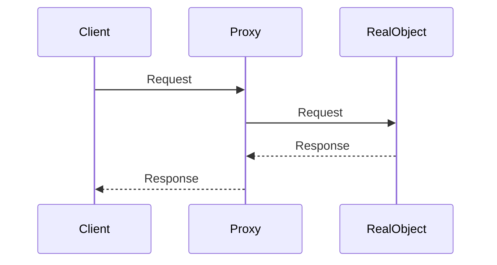

# Proxy

The Proxy pattern aims to create an object that intercepts the communication between the client and the real object or 
between two classes (A and B). It defines the input and output of this communication, hiding unnecessary details or 
adding relevant information through some internal logic.

Example of the application of the pattern:

A great example is the ORM (Object-Relational Mapping) used in many projects. ORMs act as proxies between the client 
and the database. The client only knows which method to call, and the ORM is responsible for translating this method 
into a SQL query depending on the database being used, abstracting the underlying details from the client.